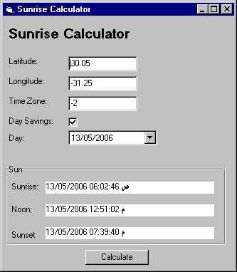



## Sunrise, Solar Noon, and Sunset Calculator

### Description

Calculates Sunrise, Solar Noon, and Sunset for any day for any location on the Earth. Based on Scott Seligman clsSunrise Class.
 
### More Info
 

             |
---                |---
**Submitted On**   |2006-05-13 18:49:06
**By**             |[Ahmed Amin Elsheshtawy](https://github.com/Planet-Source-Code/PSCIndex/blob/master/ByAuthor/ahmed-amin-elsheshtawy.md)
**Level**          |Intermediate
**User Rating**    |5.0 (20 globes from 4 users)
**Compatibility**  |VB 3\.0, VB 4\.0 \(16\-bit\), VB 4\.0 \(32\-bit\), VB 5\.0, VB 6\.0, VB Script, ASP \(Active Server Pages\) , VBA MS Access, VBA MS Excel
**Category**       |[Complete Applications](https://github.com/Planet-Source-Code/PSCIndex/blob/master/ByCategory/complete-applications__1-27.md)
**World**          |[Visual Basic](https://github.com/Planet-Source-Code/PSCIndex/blob/master/ByWorld/visual-basic.md)
**Archive File**   |[Sunrise\_\_S1994565162006\.zip](https://github.com/Planet-Source-Code/ahmed-amin-elsheshtawy-sunrise-solar-noon-and-sunset-calculator__1-65314/archive/master.zip)

